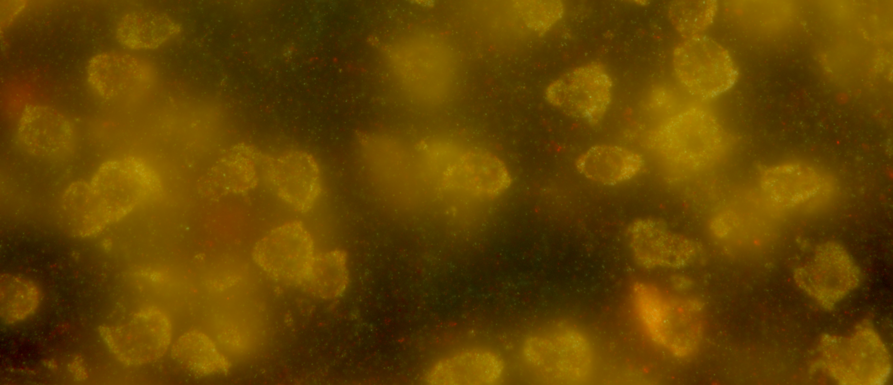

# Basic demo

## Introduction

MERFISH (multiplexed error-robust fluorescence *in situ* hybridization)
is a popular technique for identifying the genomic species of mRNA
molecules while they are still spatially embedded within their native
biological context. Thus, as the below image shows, a slice of tissue
containing many cells and preserving their spatial layout can be imaged
while successive rounds of hybridizing probes fluoresce.



True-color image of fluorescing probes bound to mRNA molecules in
cortical cells, the raw data of spatial transcriptomics.

After capturing the images and reidentifying the same spot over the many
rounds of hybridization, a “barcode” can be read off each spot. These
barcodes are a series of 1s and 0s, 1 if the spot fluoresced in a given
round, 0 if not. Which probes are used and their order are, of course,
not haphazard. Probes are selected so that mRNA molecules from genes of
interest will exhibit a known barcode. These barcodes are stored in a
*codebook*, i.e., a matrix with columns as bits (1 or 0), rows as gene
identities, and entries the value 1 or 0 according to whether an mRNA
molecule of the gene represented by the row is expected to fluoresce in
the hybridization round represented by the column.

As the above image might suggest, reading bits correctly is nontrivial:
background luminescence, scattered light, variation in probe luminance,
and hybridization failures all contribute to *bit flips*. A 1\rightarrow
0 bit flip happens when an mRNA molecule of species g is expected
(according to the code in the codebook and the underlying biology) to be
read as a 1, but is in fact read as a 0. Conversely, a 0\rightarrow 1
bit flip happens when the molecule is expected to be read as a 0, but is
read as a 1.

Typically, MERFISH codebooks are constructed so that the Hamming
distance between any two gene barcodes is at least four. That is, any
two gene barcodes differ on at least four bits. This allows for
probabilistic read correction: If a spot is, e.g., read as a barcode
that’s three off (i.e., three bit flips away from) the barcode for gene
g and more than three off the barcodes for all other genes g', then it’s
likely that the spot is an mRNA molecule of species g.

Of course, “likely” does not mean “guaranteed”. It’s been known since
the introduction of MERFISH that long barcodes, i.e., those more than
twenty bits, can be expected to have around half of spots decoded as the
wrong mRNA species [(Moffitt and Zhuang
2016)](https://doi.org/10.1016/bs.mie.2016.03.020). These errors are not
spread randomly. Some genes will have much higher error rates than
others. The reason is that bit flips themselves are not random or
uniform. The rate at which a bit flips from 1 to 0 or 0 to 1 depends on
the bit, and whether a bit flips is not independent of whether other
bits flip. There are bit-flip correlations.

The flipFISH package provides a tool for estimating bit flip rates and
bit-flip correlations, and, in turn, the error rate. More specifically,
it allows for estimating *positive predictive value* (PPV). For a
barcode b, let k\_{\mathrm{corrected}}(b) be the number of spots decoded
as b after error correction. Let k\_{\mathrm{corrected}}^{\checkmark}(b)
be the number of “hits”, i.e., the number of spots decoded as b after
error correction which are, in fact, of the gene species encoded by b.
Then: \begin{equation\*} \mathrm{PPV}(b) = \frac{
k\_{\mathrm{corrected}}^{\checkmark}(b) } { k\_{\mathrm{corrected}}(b) }
\end{equation\*} The rest of this tutorial gives a basic overview of
using flipFISH to calculate PPV.

## Data loading

Grab MERSCOPE codebook. Must have row names in the first column giving
species names.

``` r

file_path <- system.file(
  "extdata",
  "codebook_obs.csv",
  package = "flipFISH"
)
codebook <- read.csv(file_path, row.names = 1)
```

Some text here.

``` r

max_correctable_Hamming_distance <- 3
```

Get summary stats

``` r

data_path_cells <- "/Users/michaelbarkasi/projects_Oviedo_lab/_molecular_mechanisms_of_ACx_lateralization/data_ACx_cells"
count_data <- wispack::make_count_data(
  data_path = data_path_cells, 
  remove_L1 = FALSE, 
  ROI_only = FALSE,
  raw = TRUE,
  drop_blanks = FALSE,
  verbose = TRUE
)
count_data <- count_data$count_data
```

Now make summary stats, for each mouse

``` r

# Extract summary statistics (mean, variance, summed counts) from data
# ...  it will return a list holding two data.frames formatted like those imported below from the csv files
summary_stats_from_data <- function(
    obs_data         # data frame, columns as barcodes (genes or blanks), rows as cells, elements as spot counts
  ) {
    
    # Extract summary statistics
    observed_rates         <- colMeans(obs_data)
    observed_variance      <- rep(NA, length(observed_rates))
    for (i in 1:length(observed_variance)) {
      observed_variance[i] <- sd(obs_data[,i])^2
    }
    observed_counts        <- colSums(obs_data)
    
    # Collect summary stats
    data <- data.frame(
      rates    = observed_rates,
      variance = observed_variance,
      counts   = observed_counts
    )
    rownames(data) <- colnames(obs_data)
    
    return(data)
    
  }

mice <- unique(count_data$mouse)
mice_masks <- lapply(mice, function(m) count_data$mouse == m)
count_data <- count_data[,13:(ncol(count_data)-6)]
summary_stats_data <- data.frame(mouse = c(), rates = c(), variance = c(), counts = c())
for (i in seq_along(mice_masks)) {
  ss <- summary_stats_from_data(count_data[mice_masks[[i]],])
  ss <- cbind(mouse = i, ss)
  summary_stats_data <- rbind(summary_stats_data, ss)
}
write.csv(
  summary_stats_data,
  file = "/Users/michaelbarkasi/projects_Oviedo_lab/R_packages/flipFISH/inst/extdata/summary_stats_all_mice.csv",
  row.names = TRUE
)
```

``` r

file_path <- system.file(
  "extdata",
  "summary_stats_all_mice.csv",
  package = "flipFISH"
)
summary_stats_data <- read.csv(file_path, row.names = 1)

m1_summary_stats <- summary_stats_data[summary_stats_data$mouse == 1,]
rownames(codebook) <- gsub("-", ".", rownames(codebook))
```

Now try new function.
